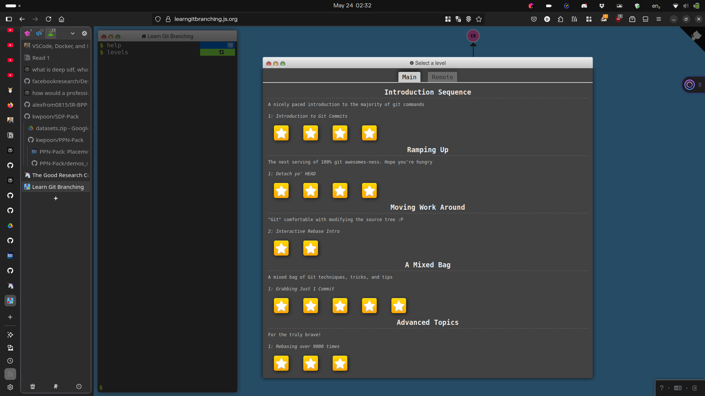
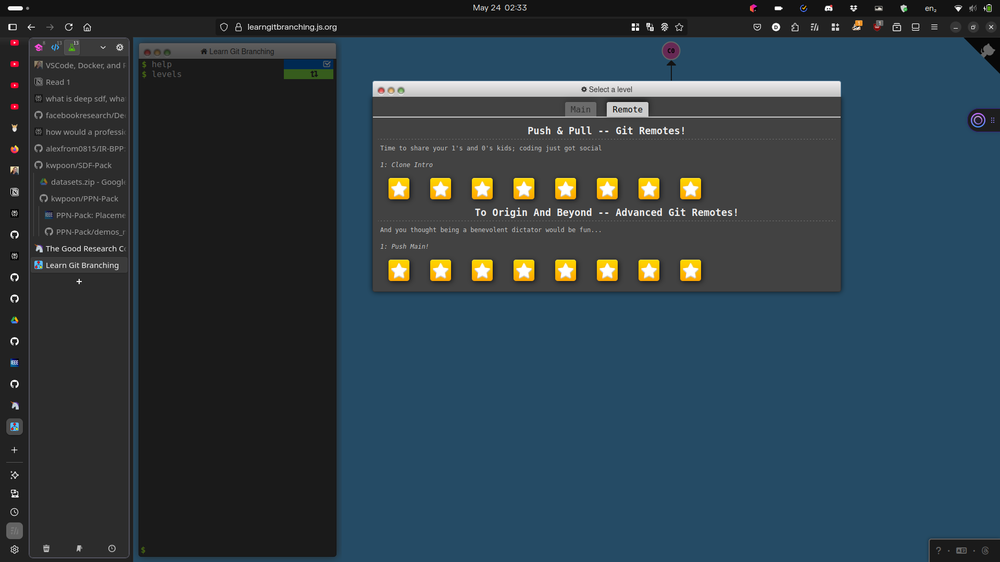

# Autonomous Ground Vehicle Research Group
## Git/Github Tasks

AGV Introductory Tasks: [ROS + Git Tasks](https://docs.google.com/document/d/1qB52Gc9wp9AnijAUdmTTTuANuoRfPfMC2oy5u0SS7iQ/edit?usp=sharing)

# Why Git?

Git is a powerful, distributed version control system that enables teams to track every change in their codebase, collaborate seamlessly, and maintain a detailed history of project evolution. In robotics and research, where projects are often complex and rapidly evolving, Git provides several benefits:
- Most projects that we'll work on will require you to collaborate with several of your batchies. In such a situation, making sure everyone's code is integrated seamlessly and does not cause any conflicts is essential. Git’s branching and merging features are excellent for ensuring all the contributions merge together smoothly.
- Git maintains a detailed version history for the project, which lets you trace back and revert any breaking changes while keeping track of the all edits made.
- Centralized repositories like GitHub (!= Git) serve as secure backups, where all your code can be saved for to prevent mishaps.

# Git - Resources and Tasks

- Resources:
  - [Interactive Git Learning Platform](https://learngitbranching.js.org) No need for doing the advance topics in both remote/main. Attach full-screen screenshots after solving the modules to your documentation like the following:
     
  - [Interactive Git to practice and experiment](https://www.msyamkumar.com/cs320/learnGitBranching/index.html) Feel free to test out and experiment with different Git methodologies.
  - [Git Cheatsheet](https://github.github.com/training-kit/downloads/github-git-cheat-sheet/)
- Extra Resources 
  - [Reference + Extra Reading](http://gitimmersion.com/index.html)
  - Book on Git- [Pro Git](http://git-scm.com/book/en/v2)
  - [Version Control (Git)](https://missing.csail.mit.edu/2020/version-control/)

## Note

While it is tempting to use certain VS Code extensions / GitHub Desktop App, nothing offers the same amount of flexibility as Git through the terminal. **Needless to say, do all these tasks using your terminal**.

## Task 1

Add your name to this list below 'Entries'.

- **Fork the repo, create a new branch (called Task1), make changes and send a pull request**
  - [This article](https://help.github.com/articles/using-pull-requests/) should give you a good idea of what pull requests are how to use them.

Your entry should maintain alphabetic order and it should be in the format:
   * ` your name [username](http://github.com/username)`.  

- Your Pull Request must have only one commit (if there are multiple commits, you should squash them). 
- Only one file should be there in the diff of your Pull Request.

### Entries

ENTER NAMES HERE \

Abhinav Tiwari[atiwari1704](https://github.com/atiwari1704)  
Abhishek Lakote[abhilakote01](https://github.com/abhilakote01)
Agneev Maitra [agneevopter](http://github.com/agneevopter) 
Akshat Shukla [Akshat-Shu](https://github.com/Akshat-Shu)  
Allu Gowri Sasaank [allugowrisasaank](https://github.com/allugowrisasaank)  
Aneesh Lade [ani26052007](https://github.com/ani26052007)
Anshumaan Mishra [AnshumaanMishra](https://github.com/AnshumaanMishra)  
Arnav Bhandari [arnavbhandari414](https://github.com/arnavbhandari414) 
Aryan Pokhriyal [Aryan1Pokhriyal](https://github.com/Aryan1Pokhriyal)  
Aryan Ruat [AryanRaut24](https://github.com/AryanRaut24)  
Attadarshi Meshram [attadarshikgp](https://github.com/attadarshikgp)  
Gokul Vemuri [gokidaman](http://github.com/gokidaman)  
Hetarth Somani [hetarth-somani](https://github.com/hetarth-somani)  
Ibtesam Ahmed [ibte7](http://github.com/ibte7)  
Jinansh Dalal [jinansh-dalal](http://github.com/jinansh-dalal)  
Kunjika Tripathi [Kunjika07] (http://github.com/Kunjika07)  
Mahin Sanklecha [MahienSanklechaa](https://github.com/MahienSanklechaa)
Md Musheer Khan [noob-dev-mk](http://github.com/noob-dev-mk)  
Mohak Agarwal [Mohak0245](https://github.com/Mohak0245)  
Moksh Patel [T3CH-Pyth0n](https://github.com/T3CH-Pyth0n)  
Netra Nandankar [n-e-t-r-a](https://github.com/n-e-t-r-a)
Oishi Nandi [oishi-nandi](http://github.com/oishi-nandi)  
Prabhuti Arora [prabhutiarora](https://github.com/prabhutiarora)
Ratharv Rathore ratharvrathore(http://github.com/ratharvrathore)  
Rishi Songirkar [OS-IT1](https://github.com/OS-IT1)  
Rohan Kumar Sah [rosa479](https://github.com/rosa479)  
Saksham Kumar [saksham-kumar-14](https://github.com/saksham-kumar-14)  
Shrey Nayakpara [ShreyNayakpara](https://github.com/ShreyNayakpara)  
Sohan Choudhury [sohan-choudhury](https://github.com/spak1235)  
SOmisetty Venkata Saran[FlyingNInja420](http://github.com/FlyingNInja420)  
Soumya Gupta [mugiwara6900](http://github.com/mugiwara6900)  
Spandan Das [spandandas489](http://github.com/spandandas489)  
Tanishq Saxena [saxenatanishq](https://github.com/saxenatanishq)  
Uday Kalyan S [uday-kalyan-s](http://github.com/uday-kalyan-s)  
Uddipto Mandal [UddiptoMandal](https://github.com/UddiptoMandal)  
Yash Bhatt [Curiousforever](https://github.com/Curiousforever)  
Yash Shah [yash-y-shah](https://github.com/yash-y-shah)  
Yug Bargaway [YugBargaway2006](https://github.com/YugBargaway2006)  
Reeck Mondal [TheRGuy9201](https://github.com/TheRGuy9201)

## Task 2

After all of you send a Pull Request, I'll add my name to 'Entries'. 

- Configure a remote that points to the upstream repository in Git to sync changes you make in a fork with the original repository. 
- Try to merge upstream changes into your downstream repository. You'll get 'merge conflicts'.- [Remove the merge conflicts](https://help.github.com/en/articles/resolving-a-merge-conflict-using-the-command-line) and create another pull request.

## Task 3

- Create a new branch (called Task3) in your fork. Add a dummy piece of code and push it to the current branch. 
- You've now realized that you pushed something wrong. Instead of removing the commit altogether, **push another commit that will undo the changes made**. 
- Create a pull request.

Why not remove the commit altogether? \
This prevents Git from losing history, which is important for the integrity of your revision history and for reliable collaboration.

##  Task 4

- Create a new branch (called Task4) in your fork. Add a dummy piece of code and push it to the current branch. 
- You've now realized that you've pushed something that is not only wrong but also stupid. You regret it so much that you want the commit to vanish altogether. 
Use reset to **remove this commit**. 

## Task 5

- Create a new branch (called Task5) in your fork. Add a dummy piece of code and commit it to this branch. Do this 5 more times. 
- Now you want to **remove some intermediate commits**. Remove commit no. 2 and 4 using rebase.
- Push all the commits into Task5 and create a Pull Request.

Some guidelines for the tasks:

* Your Pull Request must be rebased on the latest master.  
* This commit must have a message that is explanatory. For eg. for Task 1: `Add name to README (Name here)`.
* Name of the PR must be informative. For eg. for Task 1: `(Task1) Add my name to the README (Name here)`.

